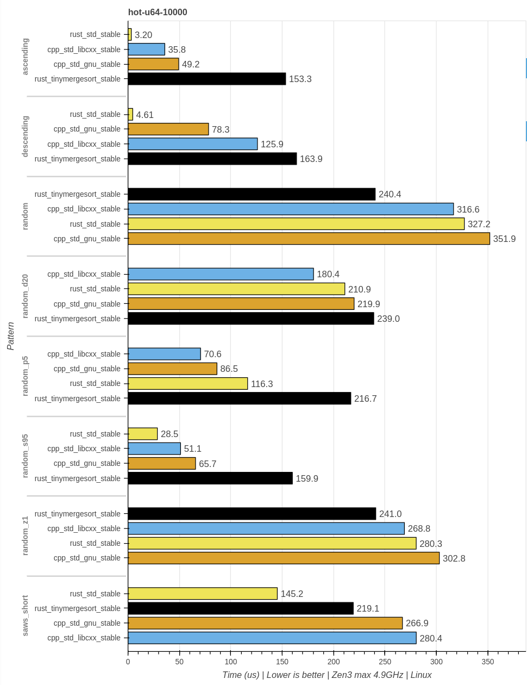
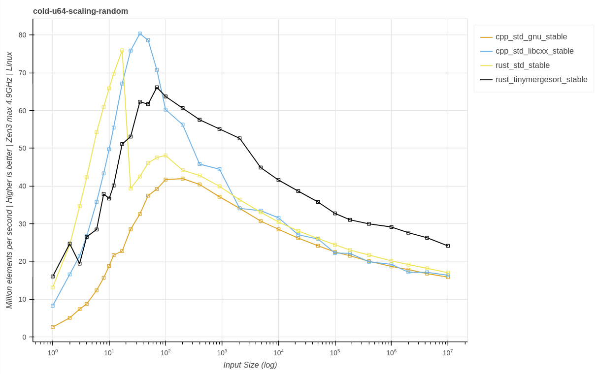
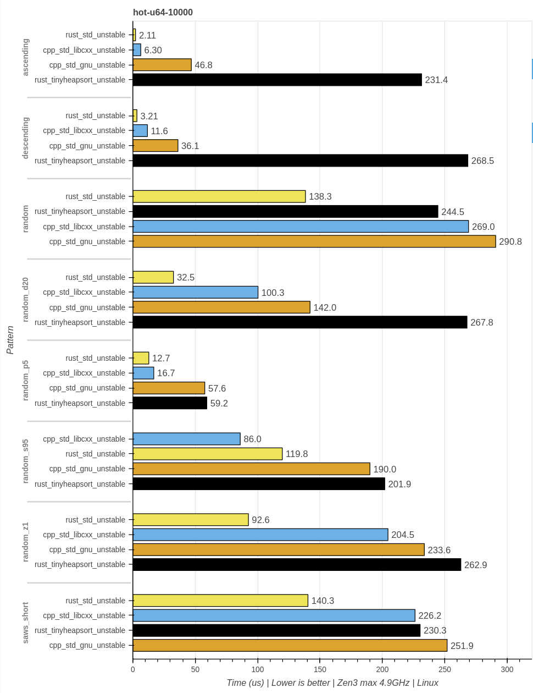
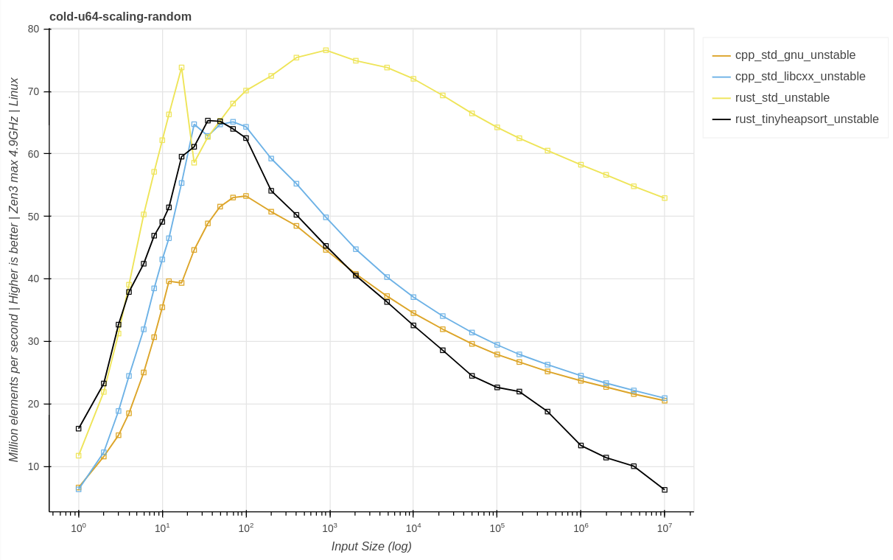

# `tiny_sort` binary-size optimized sort implementations

The tiny_sort crate provides two sort implementations `tiny_sort::stable::sort` and `tiny_sort::unstable::sort`. The crate is `no_std` and both versions can be disabled via features, by setting `default-features = false`. `tiny_sort::stable::sort` requires `alloc`, `tiny_sort::unstable::sort` doesn't. In addition to `fn sort<T: Ord>(v: &mut [T])`, both sort implementations also provide `fn sort_by<T, F: FnMut(&T, &T) -> Ordering>(v: &mut [T], mut compare: F)` to sort with a custom comparison function.

Use these sort implementations if you care about binary-size more than you care about performance. Otherwise use `slice::sort` and `slice::sort_unstable`.

## A closer look at the implementations.

### `stable::sort`

The stable sort is a branchless mergesort. This means:

- Guaranteed O(N * log(N)) worst case perf
- No adaptiveness
- Branch miss-prediction not affected by outcome of comparison function
- Allocates N auxiliary memory.

### `unstable::sort`

The unstable sort is a branchless heapsort. This means:

- Guaranteed O(N * log(N)) worst case perf
- No adaptiveness
- Branch miss-prediction not affected by outcome of comparison function

## Benchmarks

### Setup

```text
Linux 6.3
rustc 1.72.0-nightly (498553fc0 2023-05-29)
clang version 15.0.7
gcc (GCC) 13.1.1 20230429
AMD Ryzen 9 5900X 12-Core Processor (Zen3 micro-architecture)
CPU boost enabled.
```

Contestants:

```text
- rust_tinymergesort_stable    | This crate' `stable::sort`
- rust_std_stable              | `slice::sort` https://github.com/rust-lang/rust (1)
- cpp_std_gnu_stable           | libstdc++ `std::sort_stable` (2)

- rust_tinyheapsort_unstable   | This crate' `unstable::sort`
- rust_std_unstable            | `slice::sort_unstable` https://github.com/rust-lang/rust (1)
- cpp_std_gnu_unstable         | libstdc++ `std::sort` (2)
```

Footnotes:

1. Vendored ca. mid 2022.
2. Built with gcc.

### Binary-size

A minimal program is compiled with `--release`, `lto = "thin"` and `opt-level = "s"` for the Rust code and `-Os` for the header only C++ code. The C++ code is compiled with gcc. And the resulting binary is stripped with `strip`.

```rust
#[inline(never)]
fn instantiate_sort<T: Ord + std::fmt::Display>(mut v: Vec<T>) {
    tiny_sort::unstable::sort(&mut v);

    // side-effect
    println!("{}", v[v.len() - 1]);
}

fn main() {
    use std::env;
    let len = env::args().len();

    // The vec pattern is hard to predict for the compiler.
    // And the len is unknown by design.
    // Plus instantiate_sort is forced to inline never which means it has to be
    // compiled in a way that could accept all possible layout of v.
    instantiate_sort((0..len as u64).rev().collect());
}
```

The baseline with the sort uncommented is: `292864 bytes`. The values below are the stripped binary size subtracted from the baseline.

```text
- rust_tinymergesort_stable    | 648 bytes
- rust_std_stable              | 2928 bytes
- cpp_std_gnu_stable           | 5528 bytes

- rust_tinyheapsort_unstable   | 304 bytes
- rust_std_unstable            | 3848 bytes
- cpp_std_gnu_unstable         | 2128 bytes
```


### Runtime

A *rough* estimate what kind of performance you can get with these sort implementations. *If you care about performance use `slice::sort` and `slice::sort_unstable`.*

#### `stable::sort`

##### `hot-u64-10k`



##### `cold-u64-scaling-random`



#### `unstable::sort`

##### `hot-u64-10k`



##### `cold-u64-scaling-random`



## Contributing

Please respect the [CODE_OF_CONDUCT.md](CODE_OF_CONDUCT.md) when contributing.

## Versioning

We use [SemVer](http://semver.org/) for versioning. For the versions available,
see the [tags on this repository](https://github.com/Voultapher/self_cell/tags).

## Authors

* **Lukas Bergdoll** - *Initial work* - [Voultapher](https://github.com/Voultapher)

See also the list of [contributors](https://github.com/Voultapher/self_cell/contributors)
who participated in this project.

## License

This project is licensed under the Apache License, Version 2.0 -
see the [LICENSE.md](LICENSE.md) file for details.
